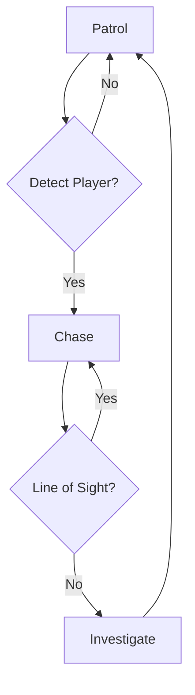

<!-- HEADER -->
<div align="center">


# Haunting Invitation

### *formerly developed as Project Haunting*

[](https://store.steampowered.com/app/3902980/Haunting_Invitation/)
[](https://www.unrealengine.com)
[](https://www.dmu.ac.uk)
[](#awards--recognition)

</div>

---

> [!WARNING]
> ## ⚠️ Repository Deprecation Notice
>
> **This repository is no longer actively maintained.**
>
> During development, the full project exceeded GitHub's storage limits due to large Unreal Engine asset files. The complete source has since been **migrated to [Diversion](https://www.diversion.dev/)**, a source control platform built for large-scale game projects.
>
> This repo serves as a **historical snapshot** of early development and documentation only.
>
> 🎮 **The game is live and fully playable on Steam:** [Haunting Invitation](https://store.steampowered.com/app/3902980/Haunting_Invitation/)

---

## 🏆 Awards & Recognition

> **🥇 Best Group Project — De Montfort University End of Year Show**
>
> *Haunting Invitation* was awarded **Best Group Project** at DMU's End of Year Showcase, recognised above all competing student titles across the entire Games Production cohort.

> **🎮 Launched on Steam**
>
> The game officially launched on **Steam** under the title **[Haunting Invitation](https://store.steampowered.com/app/3902980/Haunting_Invitation/)**, published by **De Montfort University** — one of a select number of student projects to reach a commercial storefront.

---

## 🎮 About the Game

**Haunting Invitation** is a first-person survival horror game set inside the decaying rooms of Hollow Manor. Players must explore procedurally generated environments, evade a relentless AI-driven enemy, and craft tools to uncover the manor's dark secrets — all before the invitation expires.

Built as a **group project** by second-year BSc Games Production students at **De Montfort University**, the game shipped from concept to Steam in a single academic year.

| Detail | Info |
|---|---|
| **Engine** | Unreal Engine 5.3.2 |
| **Platform** | PC (Steam) |
| **Genre** | Survival Horror / Puzzle |
| **Publisher** | De Montfort University |
| **ESRB Rating** | Teen |
| **Development Period** | 2024–2025 |
| **Source Control** | Diversion (migrated from Git) |

---

## 👥 Team

| Name | Role(s) |
|---|---|
| **Mohamed Deeq Mohamed** | Product Owner · Lead Programmer & Tech Developer |
| **Dahna Aldrighetti** | Scrum Master · Art Lead |
| **Benjamin** | Tech Developer |
| **Harmeet** | Art Team |
| **Liv** | Art Team · UI Design |

---

## 🔑 Core Features

### 🗺️ Procedural Room Generation
Hollow Manor's layout is never the same twice. Modular, prebuilt rooms are assembled at runtime using a controlled PCG workflow, with a designer-override fallback system ensuring quality-assured layouts every run.

```cpp
// DataTable Entry for Room Compatibility
USTRUCT(BlueprintType)
struct FRoomData : public FTableRowBase {
    GENERATED_BODY()
    UPROPERTY(EditAnywhere)
    FName RoomID;
    UPROPERTY(EditAnywhere)
    TArray<FName> CompatibleRooms;  // e.g., Library cannot adjoin Kitchen
};
```

### 🤖 Enemy AI System
The stalker enemy uses Behavior Trees and Unreal's EQS (Environment Query System) to patrol, detect, chase, and investigate — with a 180° FOV sight cone and a dynamic hearing radius that reacts to player noise.



### 🔧 Crafting System
A data-driven crafting system lets players combine scavenged resources into tools that directly counter the manor's threats.

| Tool | Recipe | Effect |
|---|---|---|
| Flashlight | Battery + Metal Scrap | Illuminates dark areas; briefly stuns the enemy |
| Grappling Hook | Rope + Rusty Gear | Accesses elevated platforms and shortcuts |

### 🔊 Dynamic Audio — Unreal MetaSounds
All audio is implemented using **Unreal Engine's MetaSounds** system — a node-based, procedural audio graph tool that allowed the team to build fully dynamic, reactive soundscapes. Audio layers intensify as the enemy closes distance, with a procedural heartbeat SFX system that responds to proximity in real-time. MetaSounds enabled per-instance parameter control for true runtime audio reactivity without external middleware.

### 🎨 Lumen-Powered Visuals
Leveraging UE5's **Lumen** global illumination and **Nanite** geometry streaming for dense, high-detail environments with flickering horror lighting — without performance penalties on target hardware.

---

## 🏗️ Technical Architecture

### Modular Plugin System
Systems are decoupled into Game Feature plugins following Unreal's Modular Gameplay pattern, allowing isolated development, testing, and toggling of individual features.

```
/Plugins/GameFeatures/
    /GrapplingSystem/
        /Content/Animations/, /Blueprints/
        GrapplingSystem.uplugin
    /PuzzleSystem/
        /Content/Blueprints/, /Materials/
        PuzzleSystem.uplugin
```

### Asset Naming Conventions

| Prefix | Type | Example |
|---|---|---|
| `BP_` | Blueprints | `BP_Flashlight` |
| `M_` | Materials | `M_WallMaterial` |
| `SM_` | Static Meshes | `SM_Table` |
| `SK_` | Skeletal Meshes | `SK_Hero` |
| `T_` | Textures | `T_Wallpaper` |
| `WBP_` | Widget Blueprints | `WBP_HealthBar` |
| `DA_` | Data Assets | `DA_EnemyStats` |

### Project File Structure

```
/Content/
    /HollowManor/
        /Characters/
        /Environments/
        /Core/           ← Essential game systems
        /Interactables/
        /FX/
        /UI/
        /Audio/
        /Maps/
    /MaterialLibrary/    ← Shared materials & textures
    /Plugins/            ← Project plugins
```

---

## 🎮 Controls

<div align="center">


</div>

Full input remapping is supported for both Xbox and PlayStation controllers via Unreal's `EnhancedInputSystem`.

---

## ♿ Accessibility

- Full controller remapping via `EnhancedInputSystem`
- Multi-language support via Unreal's `Localization Dashboard`
- Subtitle support for all voiced/audio cues
- Adjustable audio mixing for SFX, music, and voice independently

---

## 📋 Technical Design Document

<details>
<summary><strong>Click to expand full TDD</strong></summary>

### TDD Overview
- **Version**: 0.5 | **Last Updated**: April 8, 2025
- **Technical Focus**: Procedural Generation, AI & Shaders
- **Design Focus**: Gameplay & Level Design

### AI & Logic Implementation
- Perception radii visualised with `DebugDraw` during development
- NavMesh pathing via console command `Show NavMesh`
- Lost Player Edge Case: AI uses EQS to search last known location for 30s before resuming patrol

### Performance Optimisation
- Level streaming via `World Partition` to manage memory footprint
- Off-screen actor culling for runtime performance

### Quality Assurance — Playtesting Phases
1. **Pre-Alpha**: Core movement & AI detection
2. **Beta**: Full procedural generation with QA pass
3. **Release Candidate**: Full polish + platform certification

### Risk Mitigation

| Risk | Mitigation |
|---|---|
| Procedural generation lag | Precomputed room graph + async streaming |
| AI pathfinding failures | Manual `NavModifier` zones + bi-weekly EQS audits |
| Crafting exploits | Unit tests validate recipe inputs nightly |

### SCRUM Workflow
- **Sprint 1 (Apr 7–20)**: Prototype procedural room generation & Enemy AI
- **Sprint 4 (May 5–12)**: QA polish for Closed Beta

```
main                        // Stable builds only
├── feature/ai-pathfinding  // Feature branches
├── feature/crafting-system
└── release/v1.0            // Release candidates
```

</details>

---

## 🔗 Links

- 🎮 **[Play on Steam](https://store.steampowered.com/app/3902980/Haunting_Invitation/)** — *Haunting Invitation*
- 📋 **[SCRUM Board](https://alexa03.atlassian.net/jira/software/projects/SCRUM/boards/1)** — Jira
- 🏫 **[De Montfort University](https://www.dmu.ac.uk/home.aspx)**

---

## 📚 References

- [MetaSounds in Unreal Engine — Epic Games Docs](https://dev.epicgames.com/documentation/en-us/unreal-engine/metasounds-in-unreal-engine)
- [Game Features & Modular Gameplay — Unreal Engine Docs](https://dev.epicgames.com/documentation/en-us/unreal-engine/game-features-and-modular-gameplay-in-unreal-engine)
- [Data-Driven Gameplay Elements — Unreal Engine Docs](https://dev.epicgames.com/documentation/en-us/unreal-engine/data-driven-gameplay-elements-in-unreal-engine)
- [Data Registries in Unreal Engine](https://dev.epicgames.com/documentation/en-us/unreal-engine/data-registries-in-unreal-engine)
- [Modular Game Features in UE5 — Epic Games Blog](https://www.unrealengine.com/en-US/blog/modular-game-features-in-ue5-plug-n-play-the-unreal-way)
- [Component Pattern — Game Programming Patterns](https://gameprogrammingpatterns.com/component.html)

---

<div align="center">

*Developed by BSc Games Production students at De Montfort University, Leicester, UK.*

**🏆 Best Group Project — DMU End of Year Show**

</div>
